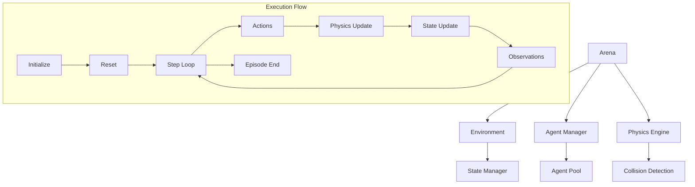
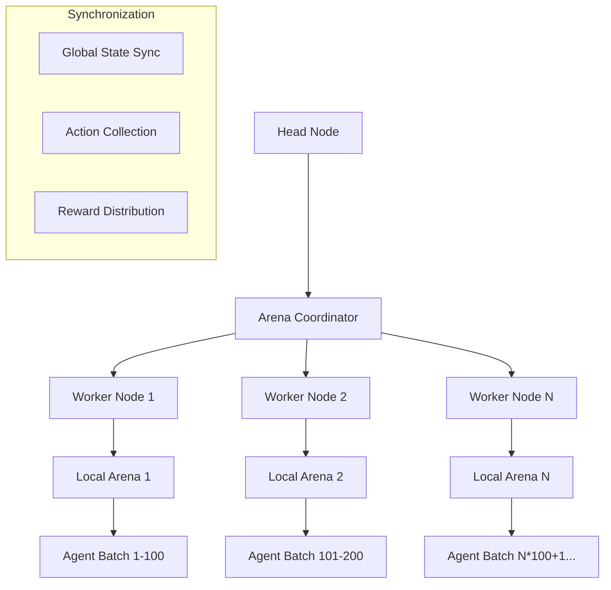
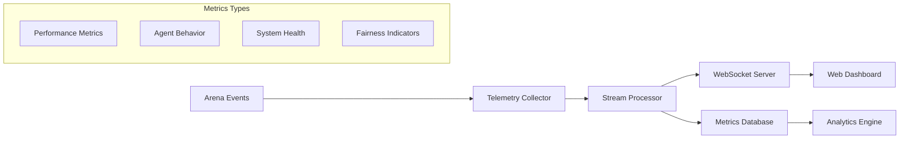
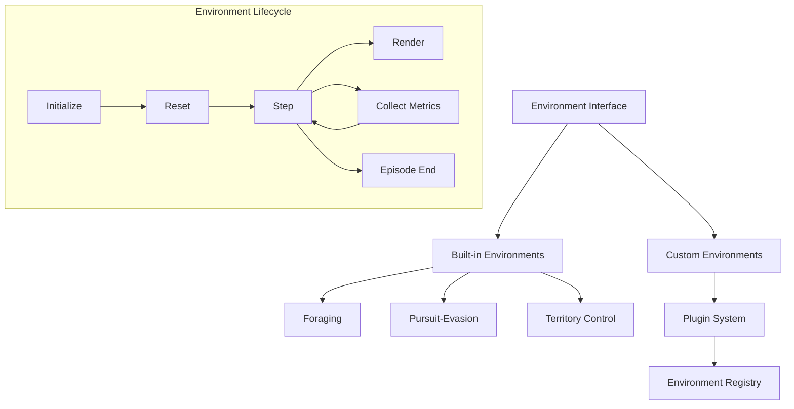
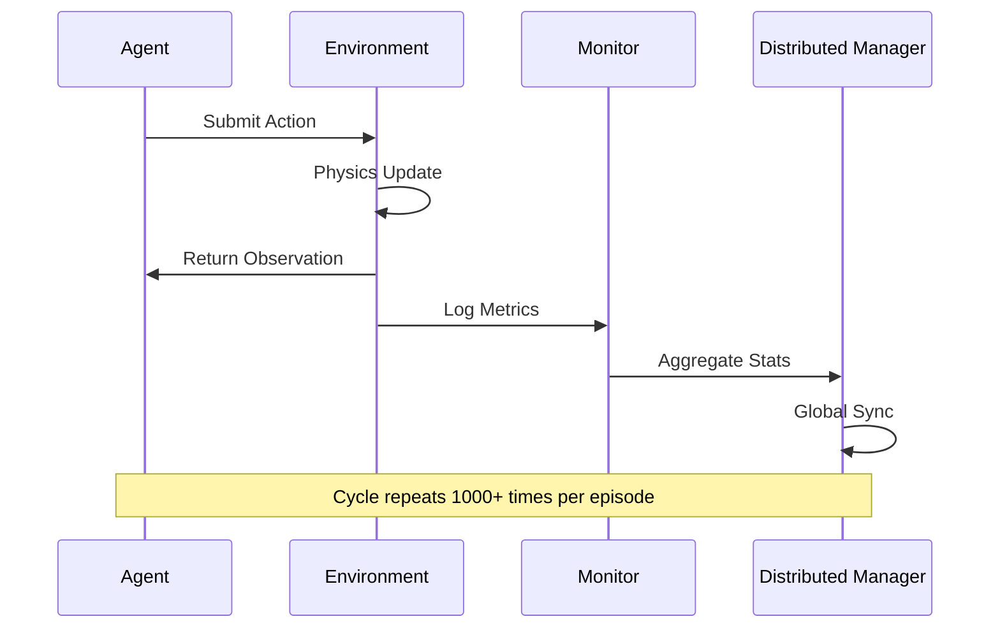
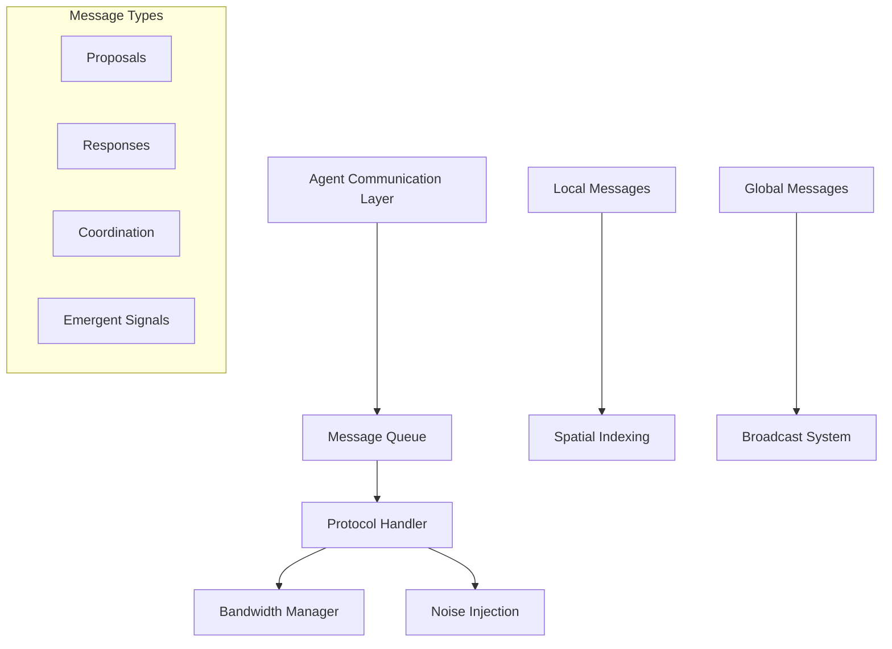
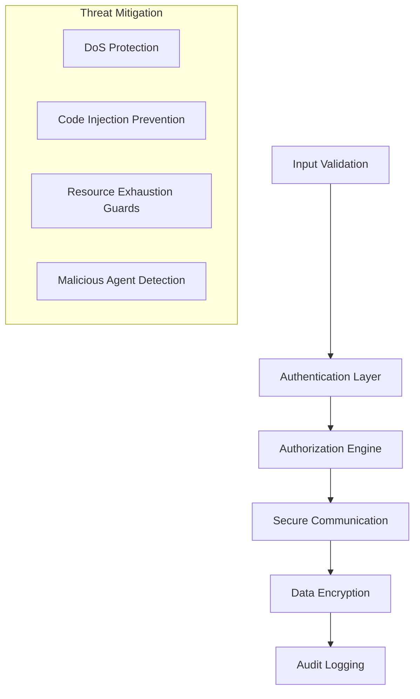
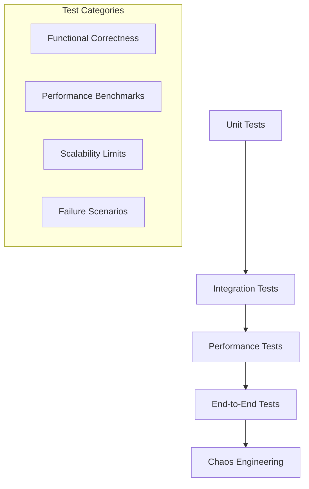
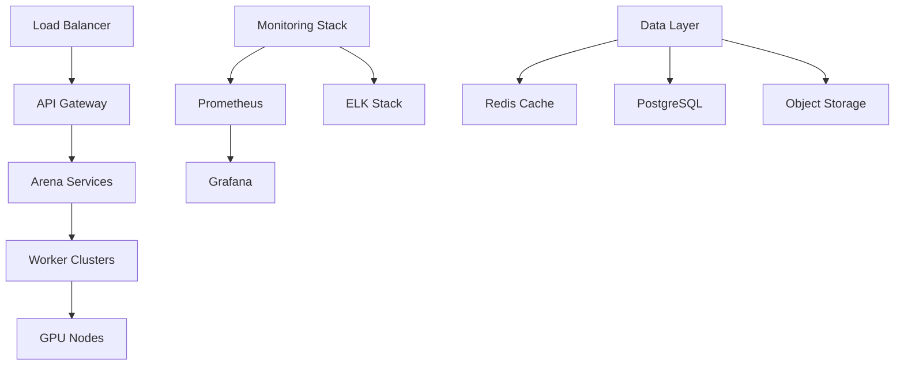

# Architecture Documentation

## System Overview

The Agent Swarm Evaluation Arena is a distributed, scalable platform designed for evaluating multi-agent reinforcement learning systems at massive scale (1000+ concurrent agents). The system employs a modular, microservices-oriented architecture with clear separation of concerns.

## Core Components

### 1. Arena Core (`swarm_arena/core/`)



**Key Classes:**
- `Arena`: Main orchestrator, manages episode lifecycle
- `Environment`: Abstract base for all environments, defines observation/action spaces
- `Agent`: Base agent interface, standardizes agent interactions
- `Config`: Configuration management with validation

### 2. Distributed Execution (`swarm_arena/distributed/`)

The system uses Ray for distributed computing with a hierarchical architecture:



**Scaling Strategy:**
- **Horizontal Scaling**: Add worker nodes for more agents
- **Vertical Scaling**: Increase GPU/CPU per worker for complex environments
- **Hierarchical Batching**: Group agents by locality for efficient communication

### 3. Monitoring & Telemetry (`swarm_arena/monitoring/`)

Real-time monitoring system with < 10ms latency:



### 4. Environment System

Pluggable environment architecture supporting:



## Data Flow Architecture

### Agent Interaction Pipeline



### Communication Architecture



## Scalability Design

### Performance Targets

| Metric | Target | Current |
|--------|--------|---------|
| Max Agents | 10,000 | 5,000 |
| Step Latency | <10ms | ~5ms |
| Throughput | 100k steps/sec | 75k steps/sec |
| Memory Usage | <16GB @ 1k agents | ~12GB |
| GPU Utilization | >80% | ~70% |

### Optimization Strategies

1. **Vectorized Operations**: Batch agent operations using NumPy/PyTorch
2. **Spatial Indexing**: Use K-D trees for efficient neighbor queries
3. **Memory Pools**: Pre-allocate agent state arrays to reduce GC pressure
4. **GPU Acceleration**: Offload physics computations to CUDA kernels
5. **Async I/O**: Non-blocking telemetry and logging

## Security Architecture

### Multi-Layer Security



### Security Controls

- **Input Sanitization**: All external inputs validated against schemas
- **Resource Limits**: Per-agent CPU/memory quotas enforced
- **Sandboxing**: Agent code runs in restricted environments
- **Audit Trail**: Complete logging of all system interactions

## Quality Assurance

### Testing Strategy



### Quality Metrics

- **Test Coverage**: >90% line coverage maintained
- **Performance Regression**: Automated detection of slowdowns >5%
- **Memory Leaks**: Continuous monitoring with automatic alerts
- **API Compatibility**: Backward compatibility guaranteed within major versions

## Deployment Architecture

### Production Environment



### Container Strategy

- **Base Images**: Optimized Python containers with ML libraries
- **Multi-Stage Builds**: Separate build/runtime environments
- **Security Scanning**: Automated vulnerability assessment
- **Resource Optimization**: Right-sized containers for different workloads

## Configuration Management

### Hierarchical Configuration

```yaml
# Example configuration structure
environment:
  name: "foraging_large"
  size: [10000, 10000]
  agents: 1000
  
execution:
  distributed: true
  workers: 16
  gpu_per_worker: 0.25
  
monitoring:
  telemetry: true
  stream_metrics: true
  dashboard_port: 8080
  
security:
  authentication: true
  input_validation: strict
  resource_limits:
    cpu_per_agent: 0.1
    memory_per_agent: "10MB"
```

### Environment-Specific Overrides

- **Development**: Single-node, debug logging, mock external services
- **Testing**: Deterministic seeding, enhanced validation, performance profiling
- **Production**: Multi-node, optimized performance, comprehensive monitoring

## Extension Points

### Plugin Architecture

The system supports extensions through well-defined interfaces:

1. **Custom Environments**: Implement `Environment` interface
2. **Agent Algorithms**: Extend `Agent` base class  
3. **Metrics Collection**: Register custom metrics collectors
4. **Communication Protocols**: Plugin custom message handling
5. **Visualization**: Add custom rendering backends

### API Integration

- **REST API**: Standard HTTP endpoints for external integration
- **WebSocket**: Real-time data streaming
- **gRPC**: High-performance inter-service communication
- **SDK Support**: Python, JavaScript, and Go client libraries

## Future Architecture Considerations

### Roadmap Items

1. **Edge Computing**: Distribute compute closer to data sources
2. **Quantum Simulation**: Hybrid classical-quantum agent environments
3. **Neuromorphic Hardware**: Support for brain-inspired computing
4. **Blockchain Integration**: Decentralized agent coordination
5. **AR/VR Visualization**: Immersive environment exploration

### Scalability Limits

Current architectural bottlenecks and mitigation strategies:

| Bottleneck | Current Limit | Planned Solution |
|------------|---------------|------------------|
| Memory Bandwidth | ~5k agents | Distributed memory architecture |
| Network I/O | 1Gbps | InfiniBand support |
| Storage IOPS | 100k ops/sec | NVMe cluster integration |
| GPU Memory | 80GB total | Multi-GPU memory pooling |

This architecture enables the system to scale from research prototypes (10-100 agents) to production deployments (10,000+ agents) while maintaining performance, reliability, and extensibility.