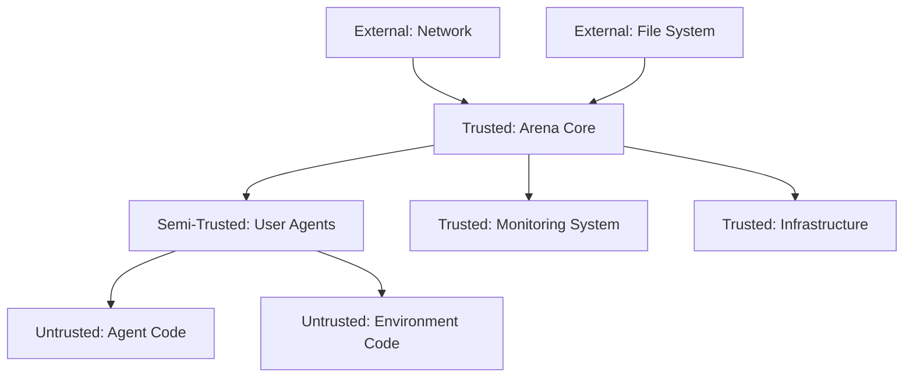

# Security Policy

## Supported Versions

We actively maintain security updates for the following versions of Agent Swarm Evaluation Arena:

| Version | Supported          | End of Life |
| ------- | ------------------ | ----------- |
| 0.1.x   | :white_check_mark: | TBD         |
| < 0.1.0 | :x:                | 2025-01-01  |

## Security Model

### Trust Boundaries

The Agent Swarm Evaluation Arena operates within the following trust model:



**Trust Levels:**
- **Trusted**: Core arena infrastructure, monitoring, and orchestration
- **Semi-Trusted**: User-provided agents running in sandboxed environments
- **Untrusted**: Custom agent algorithms and environment implementations
- **External**: Network inputs, file system access, third-party services

### Security Assumptions

1. **Infrastructure Security**: Underlying OS, container runtime, and network infrastructure are properly secured
2. **Input Validation**: All external inputs are validated before processing
3. **Resource Isolation**: Agents cannot access resources outside their allocated limits
4. **Code Sandboxing**: User-provided code runs in isolated environments
5. **Network Security**: Network communications are encrypted and authenticated

## Security Features

### Input Validation and Sanitization

All external inputs are validated using Pydantic models and custom validators:

```python
# Example: Configuration validation
class ArenaConfig(BaseModel):
    num_agents: int = Field(gt=0, le=10000)
    arena_size: Tuple[int, int] = Field(...)
    episode_length: int = Field(gt=0, le=1000000)
    
    @validator('arena_size')
    def validate_arena_size(cls, v):
        x, y = v
        if x <= 0 or y <= 0 or x > 100000 or y > 100000:
            raise ValueError("Invalid arena dimensions")
        return v
```

### Resource Limits and Sandboxing

Agent code runs with strict resource limits:

- **CPU Limits**: Configurable CPU quotas per agent
- **Memory Limits**: Maximum memory allocation per agent
- **Execution Time**: Timeout limits for agent decisions
- **Network Access**: Restricted network access in sandboxed mode
- **File System**: Read-only access to approved directories only

### Authentication and Authorization

For enterprise deployments:

- **API Authentication**: JWT-based authentication for API access
- **Role-Based Access Control**: Fine-grained permissions for different user roles
- **Resource Quotas**: Per-user/team resource allocation limits
- **Audit Logging**: Complete audit trail of all system interactions

### Communication Security

- **Encryption**: TLS 1.3 for all network communications
- **Message Authentication**: HMAC verification for inter-agent communications
- **Rate Limiting**: Protection against denial-of-service attacks
- **Input Sanitization**: All messages validated before processing

## Vulnerability Reporting

We take security vulnerabilities seriously. If you discover a security issue, please follow our responsible disclosure process.

### Reporting Process

**DO NOT** report security vulnerabilities through public GitHub issues, discussions, or any other public forum.

Instead, please report vulnerabilities privately using one of these methods:

#### Primary Method: Email
Send an email to: **security@terragon.ai**

Include in your report:
- Description of the vulnerability
- Steps to reproduce the issue
- Potential impact assessment
- Suggested mitigation (if any)
- Your contact information (for follow-up)

#### Alternative Method: Security Advisory
Use GitHub's private security advisory feature:
1. Go to the repository's Security tab
2. Click "Report a vulnerability"
3. Fill out the private advisory form

### What to Expect

After you submit a vulnerability report:

1. **Acknowledgment** (24-48 hours): We'll confirm receipt of your report
2. **Initial Assessment** (3-5 days): We'll provide an initial impact assessment
3. **Investigation** (1-2 weeks): We'll investigate and develop a fix
4. **Disclosure Timeline** (varies): We'll work with you on responsible disclosure

### Response Timeline

| Severity | Initial Response | Fix Timeline | Disclosure Timeline |
|----------|------------------|--------------|-------------------|
| Critical | 24 hours | 7 days | 14 days |
| High | 48 hours | 14 days | 30 days |
| Medium | 5 days | 30 days | 60 days |
| Low | 7 days | 60 days | 90 days |

### Severity Classification

**Critical Severity:**
- Remote code execution
- Privilege escalation to admin/root
- Complete system compromise
- Data breach of sensitive information

**High Severity:**
- Local privilege escalation
- Authentication bypass
- Significant data exposure
- Denial of service affecting entire system

**Medium Severity:**
- Information disclosure
- Local denial of service
- Cross-site scripting (if applicable)
- Moderate data exposure

**Low Severity:**
- Minor information disclosure
- Non-exploitable vulnerabilities
- Issues requiring significant user interaction

## Security Best Practices

### For Users

#### Agent Development
- **Input Validation**: Validate all inputs in your agent code
- **Resource Management**: Properly cleanup resources (memory, file handles)
- **Error Handling**: Handle errors gracefully without exposing sensitive information
- **Logging**: Avoid logging sensitive data like API keys or personal information

```python
# Good: Secure agent implementation
class SecureAgent(Agent):
    def __init__(self, agent_id: str, config: AgentConfig):
        super().__init__(agent_id, config)
        self.api_key = os.getenv('API_KEY')  # From environment
        
    def act(self, observation: Dict) -> Action:
        # Validate observation data
        if not self.validate_observation(observation):
            return self.default_action()
        
        try:
            return self.compute_action(observation)
        except Exception as e:
            # Log error without sensitive data
            self.logger.error(f"Action computation failed: {type(e).__name__}")
            return self.default_action()
    
    def validate_observation(self, obs: Dict) -> bool:
        required_keys = {'position', 'velocity', 'nearby_agents'}
        return all(key in obs for key in required_keys)
```

#### Environment Configuration
- **Secure Defaults**: Use secure default configurations
- **Credential Management**: Store credentials securely, not in code
- **Network Security**: Use encrypted connections when possible
- **Update Dependencies**: Keep dependencies up to date

#### Deployment Security
- **Container Security**: Use minimal, updated base images
- **Network Policies**: Implement network segmentation
- **Monitoring**: Enable comprehensive logging and monitoring
- **Backup Security**: Secure backup data with encryption

### For Developers

#### Secure Coding Guidelines
- **Input Validation**: Validate all inputs at system boundaries
- **Output Encoding**: Properly encode outputs to prevent injection
- **Authentication**: Implement proper authentication and session management
- **Authorization**: Follow principle of least privilege
- **Error Handling**: Don't expose internal system information in error messages

```python
# Example: Secure input handling
def create_arena(config_data: Dict) -> Arena:
    try:
        # Validate input using Pydantic
        config = ArenaConfig.parse_obj(config_data)
    except ValidationError as e:
        # Log detailed error for debugging
        logger.warning(f"Invalid arena configuration: {e}")
        # Return generic error to user
        raise ValueError("Invalid configuration provided")
    
    # Additional business logic validation
    if config.num_agents * config.episode_length > MAX_COMPUTATION_BUDGET:
        raise ValueError("Configuration exceeds resource limits")
    
    return Arena(config)
```

#### Dependency Management
- **Vulnerability Scanning**: Regular dependency vulnerability scans
- **Version Pinning**: Pin dependency versions for reproducibility
- **License Compliance**: Ensure all dependencies have compatible licenses
- **Update Strategy**: Regular security updates with testing

#### Code Review Security Checklist
- [ ] Input validation implemented
- [ ] Output encoding applied where needed
- [ ] Authentication/authorization checks in place
- [ ] Sensitive data not logged or exposed
- [ ] Resource limits enforced
- [ ] Error handling doesn't leak information
- [ ] Dependencies are secure and up-to-date

## Known Security Considerations

### Current Limitations

1. **Agent Sandboxing**: Current sandboxing may not be sufficient for completely untrusted agent code
2. **Resource Exhaustion**: Sophisticated agents might find ways to consume excessive resources
3. **Network Security**: Default configuration allows unrestricted network access
4. **Data Privacy**: Limited built-in privacy protection for experimental data

### Planned Security Improvements

- **Enhanced Sandboxing**: Integration with container security tools
- **Resource Monitoring**: Real-time resource usage monitoring and enforcement
- **Network Policies**: Configurable network security policies
- **Data Encryption**: End-to-end encryption for experimental data
- **Security Audits**: Regular third-party security assessments

### Security Configuration

#### Production Deployment Security Checklist

- [ ] **Network Security**
  - [ ] TLS enabled for all connections
  - [ ] Firewall rules configured
  - [ ] Network segmentation implemented
  - [ ] VPN access for remote management

- [ ] **Authentication & Authorization**
  - [ ] Strong authentication enabled
  - [ ] RBAC properly configured
  - [ ] API keys rotated regularly
  - [ ] Multi-factor authentication enabled

- [ ] **Data Protection**
  - [ ] Data encryption at rest
  - [ ] Data encryption in transit
  - [ ] Secure backup procedures
  - [ ] Data retention policies defined

- [ ] **Monitoring & Logging**
  - [ ] Security event logging enabled
  - [ ] Log aggregation configured
  - [ ] Alerting for security events
  - [ ] Regular log analysis

- [ ] **System Hardening**
  - [ ] Minimal system installation
  - [ ] Regular security updates
  - [ ] Unnecessary services disabled
  - [ ] File system permissions configured

## Compliance

### Data Protection Compliance

The platform is designed to support compliance with:

- **GDPR**: European Union General Data Protection Regulation
- **CCPA**: California Consumer Privacy Act  
- **FERPA**: Family Educational Rights and Privacy Act (for educational use)
- **SOC 2**: Service Organization Control 2 (for enterprise deployments)

### Security Standards

We follow industry security standards:

- **OWASP**: Open Web Application Security Project guidelines
- **NIST**: National Institute of Standards and Technology framework
- **CIS**: Center for Internet Security benchmarks
- **ISO 27001**: Information security management standards

## Security Resources

### Internal Security Contacts
- **Security Team**: security@terragon.ai
- **Privacy Officer**: privacy@terragon.ai
- **Compliance Team**: compliance@terragon.ai

### External Security Resources
- **CVE Database**: https://cve.mitre.org/
- **GitHub Security Advisories**: Repository security tab
- **OWASP Guidelines**: https://owasp.org/
- **Python Security**: https://python.org/dev/security/

### Security Training
- **Secure Coding Practices**: Internal training materials
- **Security Awareness**: Regular security training for team members
- **Incident Response**: Training for security incident handling

## Updates to This Policy

This security policy will be reviewed and updated:

- **Quarterly Reviews**: Regular review of security practices and procedures
- **Incident-Driven Updates**: Updates following security incidents or discoveries
- **Compliance Changes**: Updates to meet new regulatory requirements
- **Community Feedback**: Incorporating feedback from security researchers

All changes to this policy will be announced through:
- Repository commits with detailed change logs
- Security mailing list notifications
- GitHub security advisories for significant changes

---

**Last Updated**: 2025-01-18
**Next Review Date**: 2025-04-18
**Policy Version**: 1.0

For questions about this security policy, contact: security@terragon.ai