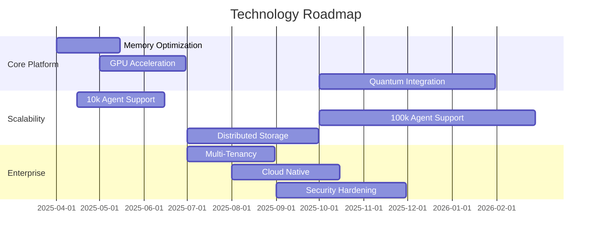

# Project Roadmap

## Vision Statement

Build the world's most scalable and comprehensive platform for multi-agent reinforcement learning evaluation, enabling researchers to test agent behaviors at unprecedented scale while maintaining scientific rigor and reproducibility.

## Current Status: v0.1.0 (Alpha)

### Completed Features ✅
- Core arena infrastructure with 1000+ agent support
- Ray-based distributed execution
- Real-time telemetry and monitoring  
- Basic environment suite (foraging, pursuit-evasion, territory)
- WebSocket-based live visualization
- Comprehensive testing framework
- Production deployment pipeline

### Known Limitations 🚧
- Memory usage optimization needed for >5k agents
- Limited communication protocol support
- Basic fairness metrics implementation
- Single-cluster deployment only

---

## Version 0.2.0: Performance & Reliability (Q2 2025)

### 🚀 Core Performance Improvements
- **Memory Optimization**: Reduce per-agent memory footprint by 50%
- **GPU Acceleration**: CUDA kernels for physics computations
- **Vectorized Operations**: Batch process agent decisions
- **Spatial Indexing**: Efficient neighbor queries using K-D trees

### 🔧 Reliability Enhancements  
- **Circuit Breakers**: Prevent cascade failures in distributed mode
- **Graceful Degradation**: Continue operation with reduced node count
- **State Checkpointing**: Resume interrupted experiments
- **Health Monitoring**: Proactive node failure detection

### 📊 Advanced Analytics
- **Emergence Detection**: Automated pattern recognition in agent behavior
- **Statistical Testing**: Built-in significance testing for experiments
- **Comparative Analysis**: Side-by-side experiment comparison tools
- **Publication Pipeline**: Automated LaTeX report generation

**Target Metrics:**
- Support 10,000+ concurrent agents
- <5ms step latency at 5k agents
- 99.9% uptime in production deployments
- Memory usage <8GB per 1k agents

---

## Version 0.3.0: Advanced Features (Q3 2025)

### 🗣️ Communication Systems
- **Protocol Framework**: Pluggable communication protocols
- **Language Evolution**: Track emergence of communication patterns
- **Bandwidth Simulation**: Realistic network constraints
- **Security Protocols**: Encrypted agent-to-agent communication

### 🎯 Fairness & Ethics
- **Comprehensive Fairness Metrics**: 20+ fairness indicators
- **Bias Detection**: Automated detection of discriminatory behaviors
- **Equity Enforcement**: Configurable fairness constraints
- **Ethics Dashboard**: Real-time ethics monitoring

### 🌍 Environment Expansion
- **Physics Engines**: Support for MuJoCo, Bullet, custom physics
- **Procedural Generation**: Automatically generated environment variants
- **Multi-Modal Environments**: Vision, audio, and text modalities
- **Hierarchical Environments**: Nested environment structures

### 🔬 Research Tools
- **Hyperparameter Optimization**: Built-in Bayesian optimization
- **Meta-Learning**: Cross-environment transfer learning evaluation
- **Curriculum Learning**: Automated difficulty progression
- **Population Training**: Co-evolutionary agent development

---

## Version 0.4.0: Enterprise & Scale (Q4 2025)

### 🏢 Enterprise Features
- **Multi-Tenancy**: Isolated environments for different research groups
- **RBAC**: Role-based access control and resource quotas
- **Cost Tracking**: Detailed resource usage and cost allocation
- **SLA Monitoring**: Service level agreement tracking

### ☁️ Cloud-Native Architecture
- **Kubernetes Native**: First-class K8s support with operators
- **Auto-Scaling**: Dynamic resource allocation based on workload
- **Multi-Region**: Deploy across multiple cloud regions
- **Edge Computing**: Support for edge node deployment

### 🔗 Integration Ecosystem
- **RLlib Integration**: Seamless Ray RLlib compatibility
- **Weights & Biases**: Native experiment tracking integration
- **MLflow**: Model lifecycle management integration
- **Jupyter Hub**: Collaborative research environment

### 📈 Massive Scale Support
- **100k+ Agents**: Support for city-scale simulations
- **Quantum Computing**: Hybrid quantum-classical agent environments
- **Neuromorphic Hardware**: Support for brain-inspired computing
- **Distributed Storage**: Petabyte-scale trajectory storage

---

## Version 1.0.0: Production Ready (Q1 2026)

### 🎯 Production Hardening
- **Security Certification**: SOC 2 compliance
- **Performance Guarantees**: SLA-backed performance commitments  
- **Enterprise Support**: 24/7 support and consulting services
- **Backwards Compatibility**: API stability guarantees

### 📚 Comprehensive Documentation
- **Research Handbook**: Best practices for MARL research
- **Deployment Guides**: Production deployment playbooks
- **API Documentation**: Complete SDK documentation
- **Video Tutorials**: Step-by-step learning resources

### 🌟 Advanced Research Capabilities
- **Automated Discovery**: AI-driven research hypothesis generation
- **Cross-Platform**: Windows, macOS, Linux support
- **Mobile Deployment**: Run experiments on mobile devices
- **AR/VR Visualization**: Immersive environment exploration

---

## Research Collaboration Roadmap

### Academic Partnerships
- **University Collaborations**: Joint research projects with top ML labs
- **Conference Presence**: NeurIPS, ICML, AAMAS workshop participation
- **Publication Support**: Co-authored papers with research community
- **Open Dataset**: Release large-scale MARL benchmark datasets

### Industry Partnerships
- **Cloud Providers**: Optimized deployments on AWS, GCP, Azure
- **Hardware Vendors**: Integration with specialized ML hardware
- **Consulting Services**: Enterprise deployment and optimization
- **Training Programs**: Professional development workshops

---

## Technology Evolution

### Architecture Improvements

### Emerging Technologies

- **Quantum Computing**: Explore quantum advantage for agent optimization
- **Neuromorphic Chips**: Low-power deployment for edge scenarios
- **5G/6G Networks**: Ultra-low latency distributed execution
- **Federated Learning**: Privacy-preserving multi-party experiments

---

## Community Roadmap

### Open Source Milestones
- **GitHub Stars**: Target 1k stars by Q2 2025, 5k by Q4 2025
- **Contributors**: 10 regular contributors by Q3 2025
- **Forks**: 100 active forks by Q4 2025
- **Issues Resolution**: <48h average response time

### Ecosystem Growth
- **Plugin Directory**: Curated collection of community extensions
- **Example Gallery**: 50+ research-ready examples
- **Integration Library**: Connectors to 20+ popular ML tools
- **Performance Benchmarks**: Regular benchmark competitions

### Educational Outreach
- **Online Course**: "Scalable Multi-Agent RL" course development
- **Workshop Series**: Monthly virtual workshops for researchers
- **Mentorship Program**: Pair experienced users with newcomers
- **Student Competitions**: Annual student research competitions

---

## Success Metrics

### Technical KPIs
| Metric | Current | v0.2 Target | v1.0 Target |
|--------|---------|-------------|-------------|
| Max Agents | 5,000 | 10,000 | 100,000 |
| Step Latency | ~5ms | <5ms | <1ms |
| Memory per Agent | ~12MB | <6MB | <1MB |
| Uptime | 95% | 99.9% | 99.99% |
| Test Coverage | 85% | 90% | 95% |

### Research Impact KPIs
| Metric | Current | v0.2 Target | v1.0 Target |
|--------|---------|-------------|-------------|
| Published Papers | 0 | 5 | 25 |
| Citations | 0 | 50 | 500 |
| Active Researchers | 10 | 100 | 1000 |
| Datasets Released | 0 | 3 | 10 |

### Community KPIs  
| Metric | Current | v0.2 Target | v1.0 Target |
|--------|---------|-------------|-------------|
| GitHub Stars | 50 | 1,000 | 5,000 |
| Active Contributors | 3 | 10 | 50 |
| Monthly Downloads | 100 | 5,000 | 50,000 |
| Forum Users | 0 | 500 | 2,000 |

---

## Risk Assessment & Mitigation

### Technical Risks
- **Scalability Bottlenecks**: Continuous performance testing and optimization
- **Distributed System Complexity**: Invest in robust testing and monitoring  
- **Security Vulnerabilities**: Regular security audits and penetration testing
- **Performance Regressions**: Automated performance testing in CI/CD

### Market Risks
- **Competition**: Focus on unique value proposition (massive scale + research focus)
- **Technology Obsolescence**: Stay current with emerging ML/RL trends
- **Adoption Barriers**: Invest heavily in documentation and user experience
- **Resource Constraints**: Secure funding and partnership agreements

### Mitigation Strategies
1. **Diversified Development**: Multiple parallel development tracks
2. **Community Building**: Reduce dependency on core team through community growth
3. **Incremental Delivery**: Regular releases with backwards compatibility
4. **Partnership Network**: Strategic alliances with research institutions and companies

---

This roadmap is a living document, updated quarterly based on community feedback, technological developments, and research priorities. Join our [Discord community](https://discord.gg/swarm-arena) to participate in roadmap discussions and influence future development priorities.